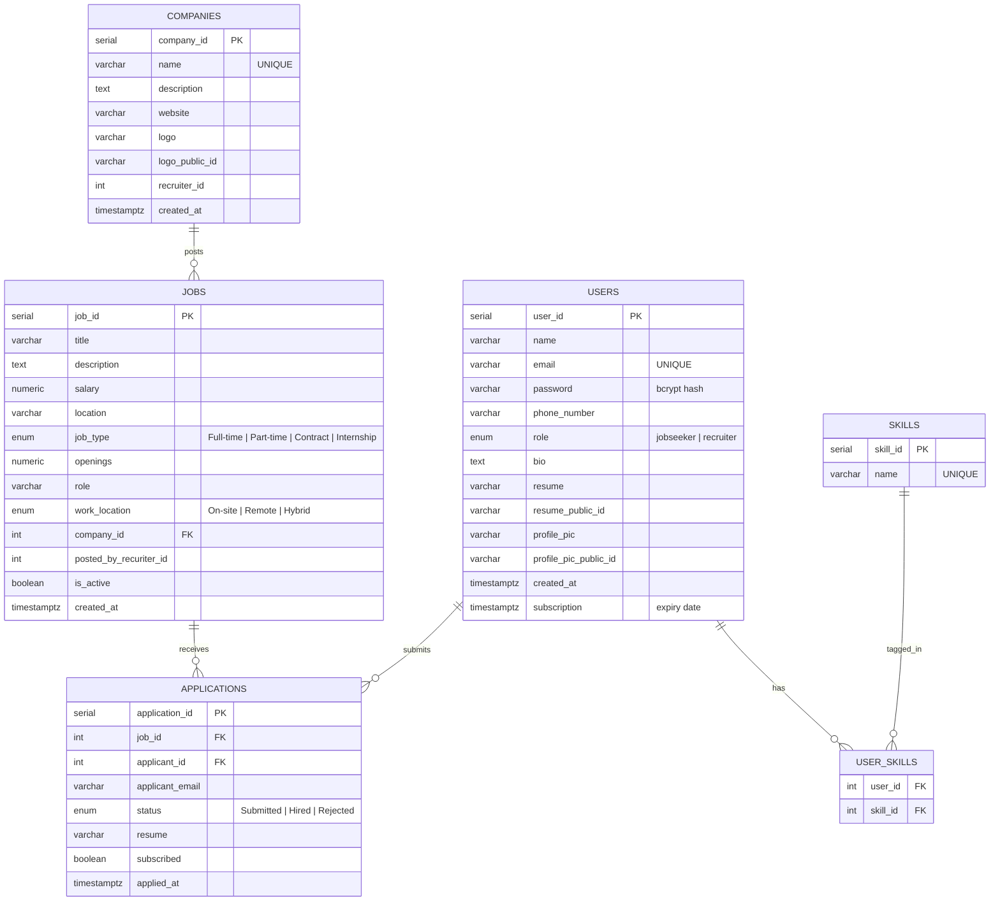
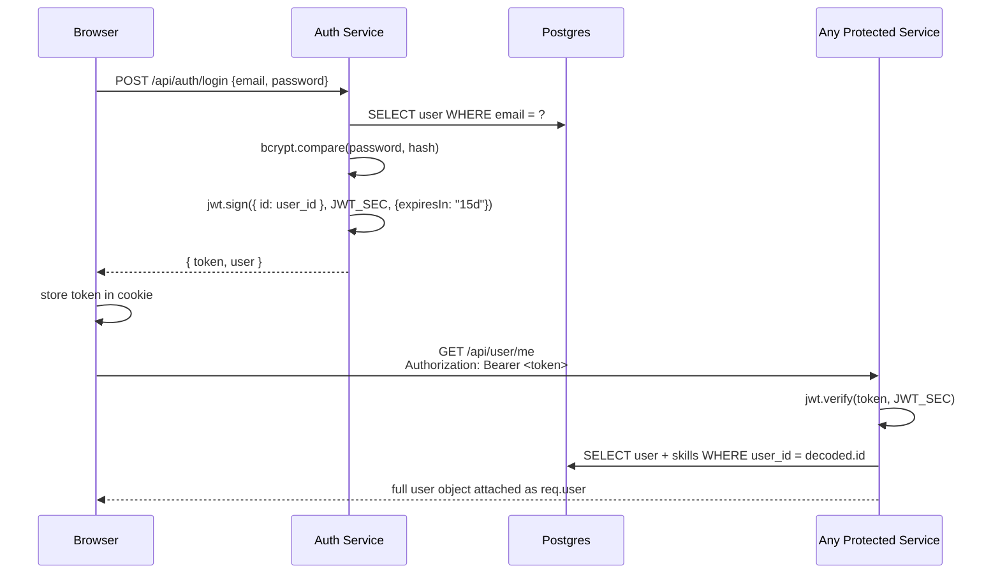
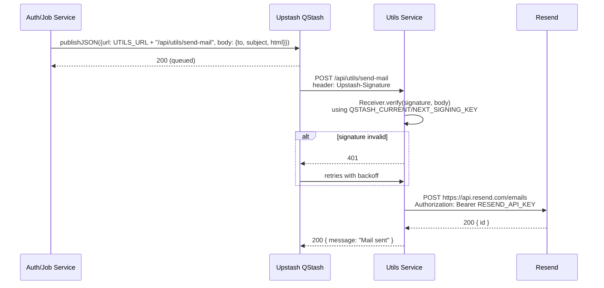

# HireHeaven — AI-Powered Job Portal & Career Platform

HireHeaven is a full-stack, microservices-based job portal that pairs a traditional job board (post jobs, apply, track applications) with **AI-driven career tooling**: an ATS resume analyzer and a personalized career-guidance engine, both powered by Google's Gemini models.

It was built to answer a simple gap in most student/job-portal projects: job boards tell you *what* jobs exist, but not *whether you're ready for them* or *what to do next*. HireHeaven tries to close that gap by giving every job seeker instant, AI-generated feedback on their resume and a concrete skill roadmap toward the roles they want — not just a list of postings.

---

## Table of Contents

- [Live Demo](#live-demo)
- [Features](#features)
  - [Job Board](#1-job-board-jobseekers--recruiters)
  - [Authentication](#2-authentication)
  - [AI Resume Analyzer](#3-ai-resume-analyzer-ats-scoring)
  - [AI Career Guidance](#4-ai-career-guidance)
  - [Application Tracking](#5-application-tracking)
  - [Recruiter / Company Dashboard](#6-recruiter--company-dashboard)
  - [Subscriptions & Payments](#7-subscriptions--payments)
  - [Transactional Email](#8-transactional-email)
- [Architecture](#architecture)
- [Tech Stack](#tech-stack)
- [Folder Structure](#folder-structure)
- [Database Schema](#database-schema)
- [API Documentation](#api-documentation)
- [Authentication Flow](#authentication-flow-deep-dive)
- [AI Integration Deep Dive](#ai-integration-deep-dive)
- [Async Messaging (QStash) Deep Dive](#async-messaging-qstash-deep-dive)
- [Running Locally](#running-locally)
- [Deploying to Production](#deploying-to-production)
- [Known Limitations](#known-limitations)
- [Roadmap](#roadmap)
- [License](#license)

---

## Live Demo

> Update these once deployed — see [Deploying to Production](#deploying-to-production).

| Service | URL |
|---|---|
| Frontend | `https://your-app.vercel.app` |
| Auth API | `https://hireheaven-auth.onrender.com` |
| User API | `https://hireheaven-user.onrender.com` |
| Job API | `https://hireheaven-job.onrender.com` |
| Payment API | `https://hireheaven-payment.onrender.com` |
| Utils/AI API | `https://hireheaven-utils.onrender.com` |

---

## Features

### 1. Job Board (Jobseekers + Recruiters)

- Public job listing (`/jobs`) with **title search** and **location filter**.
- Job detail page (`/jobs/[id]`) showing salary, location, openings, job type (Full-time/Part-time/Contract/Internship), and work mode (On-site/Remote/Hybrid).
- Recruiters can create a **company profile**, then post/edit/delete jobs under it from `/company/[id]`.
- One-click **Apply** for jobseekers (uploads their stored resume + email as the application).
- Recruiters review applicants per job and update each application's status (`Submitted` → `Hired`/`Rejected`), which triggers an automated status-update email to the applicant.

### 2. Authentication

- Email/password registration with **role selection** at signup: `jobseeker` or `recruiter`.
- Jobseekers can attach a resume (PDF) at registration time.
- JWT-based session (15-day expiry), stored in a browser cookie, sent as `Authorization: Bearer <token>` on every authenticated request.
- **Forgot/Reset password** flow: a time-limited reset link is emailed via an async pipeline (see [Async Messaging](#async-messaging-qstash-deep-dive)).

### 3. AI Resume Analyzer (ATS Scoring)

Upload a PDF resume and get back, in seconds:
- An overall **ATS compatibility score** (0–100)
- A breakdown across **formatting, keywords, structure, and readability** (each individually scored + critiqued)
- A prioritized list of **issues + actionable fixes** (high/medium/low priority)
- A list of **strengths** the resume already does well
- A short plain-English **summary**

The PDF is sent as inline base64 data directly to Gemini (`gemini-2.5-flash`) — no OCR or text-extraction step is needed; the model reads the PDF natively.

### 4. AI Career Guidance

Enter your skills (e.g. `React, Node.js, PostgreSQL`) and receive:
- An encouraging **summary** of your current profile
- 2–3 **recommended job roles** with responsibilities and a personalized "why this fits you"
- A categorized **skills-to-learn roadmap** (e.g. "Deepen Your Existing Stack," "DevOps & Cloud") with the *why* and *how* for each skill
- A **"How to Approach Learning"** action plan

### 5. Application Tracking

- Jobseekers see every job they've applied to, with live status, on their account dashboard.
- Recruiters see every applicant per job posting, with the ability to view resumes and change status inline.
- Status changes automatically fire a branded email notification to the applicant (success/rejection/pending) via the async mail pipeline.

### 6. Recruiter / Company Dashboard

- `/account` adapts based on role: jobseekers see skills + applied jobs; recruiters see their company and posted jobs.
- `/company/[id]` is the company's public + management page — recruiters get edit/delete controls on their own company's jobs; everyone else sees a read-only company profile.

### 7. Subscriptions & Payments

- A simple premium subscription (`/subscribe`) integrated with **Razorpay** checkout.
- On successful payment verification, the user's `subscription` expiry timestamp is updated, unlocking premium-gated UI (e.g. subscription status card on the account page).

### 8. Transactional Email

Two automated emails, both rendered as branded HTML templates (blue/indigo theme matching the site):
- **Password reset** — sent on `/forgot` request, expires in 15 minutes.
- **Application status update** — sent whenever a recruiter changes an applicant's status, with a color-coded status badge (green/red/blue).

Delivery is fully asynchronous via Upstash QStash + Resend — see the [deep dive](#async-messaging-qstash-deep-dive) for why, and how this differs from a typical Kafka/SMTP setup.

---

## Architecture

HireHeaven is split into **5 independent backend services** plus a Next.js frontend, all talking over HTTP. There's no shared codebase between services — each has its own `package.json`, its own slice of the Postgres database it's responsible for, and is independently deployable.

```mermaid
flowchart TB
    subgraph Client
        FE["Next.js Frontend<br/>(App Router, React 19)"]
    end

    subgraph Services["Backend Microservices (Express + TypeScript)"]
        AUTH["Auth Service<br/>:5000<br/>register/login/reset"]
        USER["User Service<br/>:5002<br/>profile/skills/applications"]
        JOB["Job Service<br/>:5003<br/>companies/jobs/applications"]
        PAY["Payment Service<br/>:5004<br/>Razorpay checkout"]
        UTILS["Utils Service<br/>:5001<br/>AI + uploads + mail webhook"]
    end

    subgraph Data["Data & 3rd-Party"]
        PG[("Neon Postgres<br/>(serverless)")]
        CLOUD["Cloudinary<br/>(resumes, photos, logos)"]
        GEMINI["Google Gemini API<br/>(REST)"]
        QSTASH["Upstash QStash<br/>(async message delivery)"]
        RESEND["Resend<br/>(email API)"]
        RAZORPAY["Razorpay<br/>(payments)"]
    end

    FE -->|REST/JSON| AUTH
    FE -->|REST/JSON| USER
    FE -->|REST/JSON| JOB
    FE -->|REST/JSON| PAY
    FE -->|REST/JSON| UTILS

    AUTH -->|publish "send-mail"| QSTASH
    JOB -->|publish "send-mail"| QSTASH
    QSTASH -->|signed webhook| UTILS
    UTILS -->|HTTPS API| RESEND

    UTILS -->|REST call| GEMINI
    UTILS -->|upload/delete| CLOUD
    PAY -->|order/verify| RAZORPAY

    AUTH --> PG
    USER --> PG
    JOB --> PG
    PAY --> PG
```

### Why microservices (and why this particular split)?

Each service owns a distinct domain: **auth** owns identity, **user** owns profile/skills/applications-from-the-jobseeker's-view, **job** owns companies/postings/applications-from-the-recruiter's-view, **payment** owns Razorpay integration, and **utils** is the shared "infrastructure" service (file storage, AI calls, the outbound-email webhook). This means each can be deployed, scaled, or rewritten independently — and a bug in payment processing can't take down login.

### Why QStash instead of Kafka?

This project originally used **Apache Kafka** for async email delivery (auth/job services publish a "send mail" event, a consumer service sends it). That's a textbook microservices pattern — but Kafka assumes a long-lived broker with real memory (1–2GB+), which free-tier hosting doesn't provide, and Upstash (the managed Kafka provider used here) discontinued Kafka for new accounts in 2025. The project was migrated to **Upstash QStash** — a serverless HTTP-based message queue — which keeps the same "publish an event, process it asynchronously, retry on failure" architecture without needing a persistent broker process. See [Async Messaging Deep Dive](#async-messaging-qstash-deep-dive) for the full mechanics.

---

## Tech Stack

| Layer | Technology |
|---|---|
| Frontend framework | Next.js 16 (App Router), React 19, TypeScript |
| Styling | Tailwind CSS v4, shadcn/ui (Radix primitives), `next-themes` (dark mode) |
| Backend framework | Express 5 + TypeScript, ESM modules |
| Database | PostgreSQL via [Neon](https://neon.tech) (serverless) — raw SQL via `@neondatabase/serverless`, no ORM |
| Auth | JWT (`jsonwebtoken`) + `bcrypt` password hashing |
| File storage | Cloudinary (resumes, profile pictures, company logos) |
| AI | Google Gemini (`gemini-2.5-flash`) via direct REST calls |
| Async messaging | Upstash QStash (HTTP-based pub/sub with signed webhooks) |
| Email delivery | Resend (HTTP email API) |
| Payments | Razorpay |
| Hosting (recommended) | Vercel (frontend) + Render (backend services) |

---

## Folder Structure

```
job-portal/
├── frontend/                          # Next.js application
│   └── src/
│       ├── app/
│       │   ├── (auth)/
│       │   │   ├── login/page.tsx
│       │   │   ├── register/page.tsx
│       │   │   ├── forgot/page.tsx
│       │   │   └── reset/[token]/page.tsx
│       │   ├── account/
│       │   │   ├── page.tsx           # Own dashboard (role-aware)
│       │   │   ├── [id]/page.tsx      # Public profile view
│       │   │   └── components/        # Info, skills, appliedJobs, company panels
│       │   ├── jobs/
│       │   │   ├── page.tsx           # Listing + filters
│       │   │   └── [id]/page.tsx      # Job detail + apply/manage
│       │   ├── company/[id]/page.tsx  # Company profile + job management
│       │   ├── career-guide/page.tsx
│       │   ├── resume-analyzer/page.tsx
│       │   ├── subscribe/page.tsx
│       │   ├── payment/success/[id]/page.tsx
│       │   ├── about/page.tsx
│       │   └── page.tsx               # Landing page
│       ├── components/                # Navbar, footer, hero, job-card, resume-analyser, carrer-guide, ui/...
│       └── context/AppContext.tsx     # Global auth/user state + API base URLs
│
└── services/
    ├── auth/src/
    │   ├── controllers/auth.ts        # register, login, forgotPassword, resetPassword
    │   ├── routes/auth.ts
    │   ├── producer.ts                 # QStash publisher
    │   ├── templete.ts                 # Password-reset email HTML
    │   └── index.ts / app.ts
    │
    ├── user/src/
    │   ├── controllers/user.ts        # profile, skills, resume/pic upload+delete, apply, applications
    │   ├── middlewares/auth.ts         # JWT verification (isAuth)
    │   ├── routes/user.ts
    │   └── index.ts
    │
    ├── job/src/
    │   ├── controllers/job.ts         # companies, jobs, applications, status updates
    │   ├── producer.ts                 # QStash publisher (status-update emails)
    │   ├── tempelete.ts                 # Application-status email HTML
    │   ├── routes/job.ts
    │   └── index.ts / app.ts
    │
    ├── payment/src/
    │   ├── controllers/payment.ts     # Razorpay checkout + verification
    │   ├── routes/payment.ts
    │   └── index.ts
    │
    └── utils/src/
        ├── routes.ts                  # Cloudinary upload/delete/download, Gemini AI endpoints
        ├── mailHandler.ts             # QStash signature verification + Resend send
        └── index.ts
```

---

## Database Schema

Each service owns its own slice of the same Postgres database (created idempotently via `CREATE TABLE IF NOT EXISTS` at service startup — there's no separate migration tool).



> `users`, `skills`, `user_skills` live in the **auth/user** services' connection; `companies`, `jobs`, `applications` live in the **job** service's connection — both point at the same Neon database, just queried by different services.

---

## API Documentation

All endpoints accept/return JSON unless noted. Protected endpoints require `Authorization: Bearer <jwt>`.

### Auth Service — `/api/auth`

| Method | Endpoint | Auth | Description |
|---|---|---|---|
| POST | `/register` | — | Create account. `multipart/form-data`: `name, email, password, phoneNumber, role, bio?, file?` (resume, jobseekers only) |
| POST | `/login` | — | `{ email, password }` → `{ token, user }` |
| POST | `/forgot` | — | `{ email }` → always returns generic success message; publishes a reset email if the account exists |
| POST | `/reset/:token` | — | `{ password }` → resets password if the token is valid and unexpired |

### User Service — `/api/user`

| Method | Endpoint | Auth | Description |
|---|---|---|---|
| GET | `/me` | ✅ | Current user's full profile (incl. skills) |
| GET | `/:userId` | ✅ | Any user's public profile |
| PUT | `/update/profile` | ✅ | `{ name?, phoneNumber?, bio? }` |
| PUT | `/update/pic` | ✅ | `multipart/form-data: file` — uploads to Cloudinary, replaces old image |
| DELETE | `/delete/pic` | ✅ | Removes current profile picture (Cloudinary + DB) |
| PUT | `/update/resume` | ✅ | `multipart/form-data: file` (PDF only) |
| POST | `/skill/add` | ✅ | `{ skillName }` |
| PUT | `/skill/delete` | ✅ | `{ skillName }` |
| POST | `/apply/job` | ✅ | `{ jobId }` — applies using stored resume |
| GET | `/application/all` | ✅ | All applications submitted by the current user |

### Job Service — `/api/job`

| Method | Endpoint | Auth | Description |
|---|---|---|---|
| POST | `/company/new` | ✅ (recruiter) | Create a company profile (with logo upload) |
| DELETE | `/company/:companyId` | ✅ (recruiter, owner) | Delete own company |
| POST | `/new` | ✅ (recruiter) | Post a new job under their company |
| PUT | `/:jobId` | ✅ (recruiter, owner) | Edit a job posting |
| GET | `/company/all` | — | List all companies |
| GET | `/company/:id` | — | Single company + its jobs |
| GET | `/all` | — | All active job postings (supports title/location query filters) |
| GET | `/:jobId` | — | Single job detail |
| GET | `/application/:jobId` | ✅ (recruiter, owner) | All applicants for a job |
| PUT | `/application/update/:id` | ✅ (recruiter, owner) | `{ status }` → updates status + sends notification email |

### Payment Service — `/api/payment`

| Method | Endpoint | Auth | Description |
|---|---|---|---|
| POST | `/checkout` | ✅ | Creates a Razorpay order for the subscription |
| POST | `/verify` | ✅ | Verifies payment signature, extends `subscription` expiry |

### Utils Service — `/api/utils`

| Method | Endpoint | Auth | Description |
|---|---|---|---|
| POST | `/upload` | — (internal) | `{ buffer, public_id? }` → uploads to Cloudinary, deletes old asset if `public_id` given |
| POST | `/delete` | — (internal) | `{ public_id }` → deletes a Cloudinary asset |
| GET | `/download` | — | `?url=` → proxies a file download (forces `Content-Disposition: attachment`) |
| POST | `/career` | — | `{ skills }` → AI career guidance (see below) |
| POST | `/resume-analyser` | — | `{ pdfBase64 }` → AI ATS resume analysis (see below) |
| POST | `/send-mail` | QStash signature | Internal webhook — receives `{ to, subject, html }`, verifies the QStash signature, sends via Resend |

---

## Authentication Flow (Deep Dive)



- The JWT payload is intentionally minimal — just `{ id: user_id }` — so every protected route always re-fetches fresh user data from Postgres rather than trusting stale claims in the token. This means role/subscription/profile changes take effect immediately, with the tradeoff of one extra DB query per request.
- Every backend service that needs `req.user` has its own copy of the `isAuth` middleware (it's a small, dependency-free piece of code — not worth a shared package for a project this size).

---

## AI Integration Deep Dive

Both AI endpoints live in `services/utils/src/routes.ts` and call Gemini via **plain HTTPS REST calls** (`axios.post` to `generativelanguage.googleapis.com`), not the `@google/genai` SDK. This was a deliberate fix: the SDK was found to negotiate an incompatible authentication mode against Google's API specifically when run from certain cloud hosting networks (manifesting as `401 ACCESS_TOKEN_TYPE_UNSUPPORTED`), while a direct REST call with the API key as a query parameter works reliably everywhere.

```mermaid
sequenceDiagram
    participant U as Browser
    participant Utils as Utils Service
    participant G as Gemini API

    U->>Utils: POST /api/utils/resume-analyser {pdfBase64}
    Utils->>Utils: strip "data:application/pdf;base64," prefix
    Utils->>G: POST /v1beta/models/gemini-2.5-flash:generateContent?key=...<br/>{contents:[{parts:[{text:prompt},{inlineData:{mimeType,data}}]}]}
    alt 503 overloaded
        G-->>Utils: 503 UNAVAILABLE
        Utils->>Utils: retry (up to 2x, exponential backoff)
        Utils->>G: retry request
    end
    G-->>Utils: { candidates: [{ content: { parts: [{ text: "...JSON..." }] } }] }
    Utils->>Utils: strip ```json fences, JSON.parse
    Utils-->>U: structured ATS report
```

Both endpoints share a `generateContentWithRetry()` helper that:
1. Normalizes the `contents` argument (plain string for career guidance, full multi-part array with `inlineData` for the PDF-based resume analysis).
2. Retries up to twice on Gemini overload errors (`503`/`UNAVAILABLE`/"high demand"), with `1500ms × attempt` backoff.
3. Extracts `candidates[0].content.parts[0].text`, strips any ```` ```json ```` code-fence markdown the model adds, and `JSON.parse`s it — surfacing a clear error if the model ever returns non-JSON.

The prompts themselves instruct Gemini to return **only** valid JSON matching an exact schema (shown in full in the [API docs](#utils-service--apiutils)), which is what lets the frontend render structured score cards, breakdowns, and skill roadmaps instead of free-form text.

---

## Async Messaging (QStash) Deep Dive



**Why a queue at all, instead of just emailing synchronously inside the request?** Because the caller (e.g. `registerUser`/`forgotPassword`/`updateApplication`) shouldn't have to wait on a third-party mail API before responding to the user — and if Resend has a hiccup, QStash will keep retrying delivery on a backoff schedule instead of losing the email outright.

**The signature verification step matters**: `/api/utils/send-mail` is a public URL. Without `Receiver.verify()`, anyone could POST arbitrary `{to, subject, html}` and use this service as an open email relay. The route is deliberately registered with `express.raw()` **before** the global `express.json()` middleware in `index.ts`, because QStash signs the exact raw request body — if Express had already parsed and re-serialized it as JSON, the signature wouldn't match.

---

## Running Locally

### Prerequisites
- Node.js 18+
- A [Neon](https://neon.tech) Postgres database (free tier)
- API keys for: [Google AI Studio](https://aistudio.google.com/apikey) (Gemini), [Upstash QStash](https://upstash.com) (messaging), [Resend](https://resend.com) (email), [Cloudinary](https://cloudinary.com), [Razorpay](https://razorpay.com) (test mode keys are fine)

### 1. Clone and install

```bash
git clone https://github.com/sumitDev11/Job-Portal.git
cd job-portal

# install each service
cd services/auth && npm install && cd ../..
cd services/user && npm install && cd ../..
cd services/job && npm install && cd ../..
cd services/payment && npm install && cd ../..
cd services/utils && npm install && cd ../..

# install frontend
cd frontend && npm install && cd ..
```

### 2. Environment variables

Create a `.env` in **each** service folder (`services/auth/.env`, etc.):

**`services/auth/.env`**
```env
PORT=5000
DB_URL=postgresql://<neon-connection-string>
UPLOAD_SERVICE=http://localhost:5001
JWT_SEC=<any-random-string>
QSTASH_URL=https://qstash-us-east-1.upstash.io
QSTASH_TOKEN=<from upstash qstash dashboard>
Frontend_Url=http://localhost:3000
```

**`services/user/.env`**
```env
PORT=5002
DB_URL=postgresql://<neon-connection-string>
UPLOAD_SERVICE=http://localhost:5001
JWT_SEC=<same as auth>
```

**`services/job/.env`**
```env
PORT=5003
DB_URL=postgresql://<neon-connection-string>
UPLOAD_SERVICE=http://localhost:5001
JWT_SEC=<same as auth>
QSTASH_URL=https://qstash-us-east-1.upstash.io
QSTASH_TOKEN=<from upstash qstash dashboard>
```

**`services/payment/.env`**
```env
PORT=5004
DB_URL=postgresql://<neon-connection-string>
JWT_SEC=<same as auth>
Razorpay_Key=<test key id>
Razorpay_Secret=<test key secret>
```

**`services/utils/.env`**
```env
PORT=5001
CLOUD_NAME=<cloudinary cloud name>
API_KEY=<cloudinary api key>
API_SECRET=<cloudinary api secret>
API_KEY_GEMINI=<google ai studio key>
QSTASH_CURRENT_SIGNING_KEY=<from upstash qstash dashboard>
QSTASH_NEXT_SIGNING_KEY=<from upstash qstash dashboard>
RESEND_API_KEY=<from resend dashboard>
```

**`frontend/.env.local`** (optional — defaults to localhost if omitted)
```env
NEXT_PUBLIC_AUTH_SERVICE=http://localhost:5000
NEXT_PUBLIC_USER_SERVICE=http://localhost:5002
NEXT_PUBLIC_JOB_SERVICE=http://localhost:5003
NEXT_PUBLIC_PAYMENT_SERVICE=http://localhost:5004
NEXT_PUBLIC_UTILS_SERVICE=http://localhost:5001
```

> ⚠️ **Note on QStash locally**: QStash is a cloud service — it cannot deliver webhooks to `localhost`. Forgot-password and application-status emails will not actually send while running fully locally unless you expose your local `utils` service via a tunnel (e.g. `ngrok`) and point `UPLOAD_SERVICE` at that public tunnel URL. Every other feature (job board, auth, AI endpoints, payments) works fully offline/locally.

### 3. Run everything

Each service has a `dev` script (TypeScript watch + nodemon):

```bash
# in 5 separate terminals
cd services/auth && npm run dev
cd services/user && npm run dev
cd services/job && npm run dev
cd services/payment && npm run dev
cd services/utils && npm run dev

# and the frontend
cd frontend && npm run dev
```

Visit `http://localhost:3000`.

---

## Deploying to Production

This project is designed to run entirely on **free tiers**:

| Component | Recommended Host | Why |
|---|---|---|
| Frontend | **Vercel** | Built for Next.js, zero-config |
| 5 backend services | **Render** (free Web Services) | Keeps Node processes alive (vs. serverless functions, which can't run a persistent consumer); one free instance per service |
| Messaging | **Upstash QStash** | Replaces Kafka; serverless, free tier |
| Database | **Neon** | Serverless Postgres, generous free tier |
| Email | **Resend** | HTTP API — works around Render's free-tier SMTP port block |

### Steps

1. **Push to GitHub.**
2. **Render** — for each service folder, create a Web Service:
   - Root Directory: `services/auth` (repeat for `user`, `job`, `payment`, `utils`)
   - Build Command: `npm install && tsc`
   - Start Command: `node dist/index.js`
   - Paste that service's `.env` contents into the dashboard's Environment tab
   - After all 5 are deployed, **update `UPLOAD_SERVICE`** on `auth`, `user`, and `job` to the real deployed `utils` URL (not `localhost`)
3. **Vercel** — import the `frontend` folder, set the `NEXT_PUBLIC_*_SERVICE` env vars to your real Render URLs.
4. **Keep Render awake** — free instances sleep after ~15 minutes idle. Add a free [UptimeRobot](https://uptimerobot.com) monitor per service (5-minute interval) to keep them warm, especially the `utils` service (its QStash webhook needs to be reachable instantly).
5. **Resend sandbox limit** — without a verified domain, Resend's default `onboarding@resend.dev` sender can only deliver to the email address you signed up to Resend with. For production use with real users, verify your own domain at `resend.com/domains` and update the `from` address in `services/utils/src/mailHandler.ts`.

---

## Known Limitations

- **Render free tier cold starts**: the first request after ~15 minutes of inactivity can take 30–60 seconds.
- **Resend sandbox restriction**: until a custom domain is verified, transactional emails can only be delivered to the Resend account owner's own email address.
- **No automated test suite** — this is a project built iteratively; correctness is currently verified via manual/live endpoint testing rather than CI.
- **Single shared Postgres instance** across services — fine at this scale, but a true microservices setup would give each service its own database.

## Roadmap

- AI-powered mock interview simulator
- Skill assessment quizzes with certificates
- Company-side analytics dashboard (applicant funnels, time-to-hire)
- Salary prediction based on skills + location
- Push notifications for application status changes

## License

This project is provided as-is for educational/portfolio purposes.
